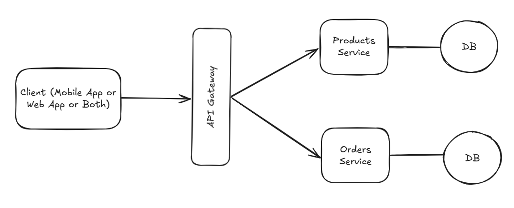

# Ecommerce Test

API para la gestión de productos y órdenes.

## Instalación

Clonar el repositorio

    git clone https://github.com/admontero/ecommerce-test.git

Cambiar a la carpeta del repositorio

    cd ecommerce-test

Instalar las dependencias de PHP usando composer

    composer install

Copia el archivo ejemplo de variables de entorno y haz las configuraciones requeridas en tu archivo .env

    cp .env.example .env

Genera una key para la aplicación

    php artisan key:generate

------------

## Docker

Cambia las siguiente variables de entorno del .env:

    DB_CONNECTION=mysql
    DB_HOST=db
    DB_PORT=3306
    DB_DATABASE=ecommerce_test
    DB_USERNAME=root
    DB_PASSWORD=password

Ejecuta el siguiente comando para ejecutar la build:

    docker-compose build

Luego levante todos los servicios:

    docker-compose up

Posterior a ello ejecute las migraciones y las semillas con el siguiente comando:

    docker exec ecommerce-test bash -c "php artisan migrate --seed"

Ahora puedes ingresar a la aplicacion desde esta url http://your_server_ip reemplazandola con su ip, o también accediendo a http://localhost:80

*Otros comandos importantes:*

Detener los servicios
    
    docker-compose down

Reiniciar los servicios
    
    docker-compose restart
    
Entrar a la consola del contenedor

    docker-compose exec app bash

## Documentación API

[Ecommerce API](https://documenter.getpostman.com/view/9609007/2sAY55bJVk)

## Autor

- [Andrés Montero](https://github.com/admontero)
